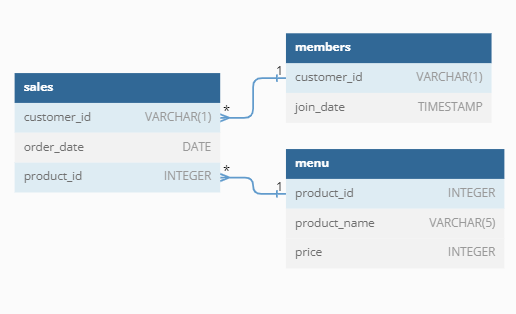
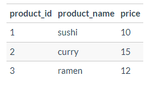

# 🍜 Case Study 1 - Danny's Diner

## CONTEXT 

A restaurant needs help to stay afloat. 
Three kinds of food : sushi, curry and ramen. 

The restaurant has captured some very basic data from their few months of operation but have no idea how to use their data to help them run the business

## PROBLEM STATEMENT 

Danny wants to use the data to answer a few simple questions about his customers, especially about their visiting patterns, how much money they’ve spent and also which menu items are their favourite. Having this deeper connection with his customers will help him deliver a better and more personalised experience for his loyal customers.

## 📁 Database Schema

Three datasets : 
* sales 
* menu 
* members 

### Entity Relationship Diagram

### Table 1 : Sales

The `sales` table is composed of : 
- **customer_id** - FOREIGN KEY 
- **order_date** - Date when the product is ordered by the customer. 
- **product_id** - FOREIGN KEY - id of the product that was ordered

### Table 2 : Menu

The `menu` table is composed of : 
- **product_id** - PRIMARY KEY 
- **product_name** - Name of the product
- **price** - Price in $ 
of the product

### Table 3 : Members 

The `members` table is composed of : 
- **customer_id** - PRIMARY KEY 
- **join_date** - When a customer joined the beta version of the Danny’s Diner loyalty program.

## 📜 Case Study Questions

1. What is the total amount each customer spent at the restaurant?
2. How many days has each customer visited the restaurant?
3. What was the first item from the menu purchased by each customer?
4. What is the most purchased item on the menu and how many times was it purchased by all customers?
5. Which item was the most popular for each customer?
6. Which item was purchased first by the customer after they became a member?
7. Which item was purchased just before the customer became a member?
8. What is the total items and amount spent for each member before they became a member?
9. If each $1 spent equates to 10 points and sushi has a 2x points multiplier - how many points would each customer have?
10. In the first week after a customer joins the program (including their join date) they earn 2x points on all items, not just sushi - how many points do customer A and B have at the end of January?

