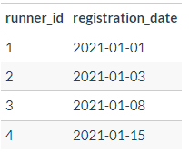

# CONTEXT 

Did you know that over 115 million kilograms of pizza is consumed daily worldwide??? (Well according to Wikipedia anyway…)

Danny was scrolling through his Instagram feed when something really caught his eye - “80s Retro Styling and Pizza Is The Future!”

Danny was sold on the idea, but he knew that pizza alone was not going to help him get seed funding to expand his new Pizza Empire - so he had one more genius idea to combine with it - he was going to Uberize it - and so Pizza Runner was launched!

Danny started by recruiting “runners” to deliver fresh pizza from Pizza Runner Headquarters (otherwise known as Danny’s house) and also maxed out his credit card to pay freelance developers to build a mobile app to accept orders from customers.

# PROBLEM STATEMENT 

Because Danny had a few years of experience as a data scientist - he was very aware that data collection was going to be critical for his business’ growth.

He has prepared for us an entity relationship diagram of his database design but requires further assistance to clean his data and apply some basic calculations so he can better direct his runners and optimise Pizza Runner’s operations.

# DATASETS 

Six datasets : 
* runners
* runners_orders
* customer_orders
* pizza_names
* pizza_recipes
* pizza_toppings 

## ERD 


## TABLE 1 : RUNNERS 

The `runners` table is composed of : 
- **runner_id** - PRIMARY KEY
- **registration_date** - Registration date of a runner_id



## TABLE 2 : CUSTOMER_ORDERS

The `customer_orders` table is composed of : 
- **order_id** - FOREIGN KEY
- **customer_id** - FOREIGN KEY
- **pizza_id** - FOREIGN KEY
- **exclusions** - ingredient_id values which should be removed from the pizza 
- **extras** - ingredient_id values which should be added to the pizza 
- **order_time** - ordered day and time of the pizza


## TABLE 3 : RUNNERS_ORDERS

The `runners_orders` table is composed of : 
- **order_id** - FOREIGN KEY
- **runner_id** - FOREIGN KEY
- **pickup_time** -  the timestamp at which the runner arrives at the Pizza Runner headquarters to pick up the freshly cooked pizza
- **distance** - distance to deliver the pizza
- **duration** - time to deliver the pizza
- **cancellation** - if there is a restaurant cancellation or a customer cancellation

## TABLE 4 : PIZZA_NAMES

The `pizza_names` table is composed of : 
- **pizza_id** - PRIMARY KEY
- **pizza_name** - name of the pizza

## TABLE 5 : PIZZA_RECIPES

The `pizza_recipes` table is composed of : 
- **pizza_id** - FOREIGN KEY
- **toppings** - ingrediens on the pizza

## TABLE 6 : PIZZA_TOPPINGS

The `pizza_toppings` table is composed of : 
- **topping_id** - PRIMARY KEY
- **topping_name** - ingredient name

# CASE STUDY 

Before we are going further, we have to clean two datasets : `customer_orders` and `runners_orders`. 

**Creating Views with data cleaning**

```sql
DROP SCHEMA IF EXISTS v_pizza_runner CASCADE; 
CREATE SCHEMA v_pizza_runner;

DROP VIEW IF EXISTS v_pizza_runner.runners; 
CREATE VIEW v_pizza_runner.runners AS
SELECT 
  *
FROM pizza_runner.runners; 

DROP VIEW IF EXISTS v_pizza_runner.customer_orders; 
CREATE VIEW v_pizza_runner.customer_orders AS
SELECT 
  order_id, 
  customer_id, 
  pizza_id, 
  CASE 
    WHEN exclusions = '' THEN NULL 
    ELSE exclusions
  END AS exclusions, 
  CASE 
    WHEN extras = '' THEN NULL 
    ELSE extras
  END AS extras,
  order_time
FROM pizza_runner.customer_orders;

DROP VIEW IF EXISTS v_pizza_runner.runners_orders; 
CREATE VIEW v_pizza_runner.runners_orders AS
SELECT 
  order_id, 
  runner_id,
  pickup_time, 
  CASE 
    WHEN distance LIKE '%km%' THEN 
      (REGEXP_MATCH(
        distance, 
        '^\d*\.?\d*'
        )
      )[1]
    ELSE distance
  END AS distance, 
  CASE 
    WHEN duration ILIKE '%mins%' OR 
      duration ILIKE '%minutes%'OR
      duration ILIKE '%minute%' THEN 
      (REGEXP_MATCH(
        duration, 
        '^\d*\.?\d*'
        )
      )[1]
    ELSE duration
  END AS duration, 
  CASE 
    WHEN cancellation = '' THEN NULL 
    ELSE cancellation
  END AS cancellation
FROM pizza_runner.runner_orders;
```
