# CONTEXT 

Did you know that over 115 million kilograms of pizza is consumed daily worldwide??? (Well according to Wikipedia anyway…)

Danny was scrolling through his Instagram feed when something really caught his eye - “80s Retro Styling and Pizza Is The Future!”

Danny was sold on the idea, but he knew that pizza alone was not going to help him get seed funding to expand his new Pizza Empire - so he had one more genius idea to combine with it - he was going to Uberize it - and so Pizza Runner was launched!

Danny started by recruiting “runners” to deliver fresh pizza from Pizza Runner Headquarters (otherwise known as Danny’s house) and also maxed out his credit card to pay freelance developers to build a mobile app to accept orders from customers.

# PROBLEM STATEMENT 

Because Danny had a few years of experience as a data scientist - he was very aware that data collection was going to be critical for his business’ growth.

He has prepared for us an entity relationship diagram of his database design but requires further assistance to clean his data and apply some basic calculations so he can better direct his runners and optimise Pizza Runner’s operations.

# DATASETS 

Six datasets : 
* runners
* runners_orders
* customer_orders
* pizza_names
* pizza_recipes
* pizza_toppings 

## ERD 


## TABLE 1 : RUNNERS 

The `runners` table is composed of : 
- **runner_id** - PRIMARY KEY
- **registration_date** - Registration date of a runner_id


## TABLE 2 : CUSTOMER_ORDERS

The `customer_orders` table is composed of : 
- **order_id** - FOREIGN KEY
- **customer_id** - FOREIGN KEY
- **pizza_id** - FOREIGN KEY
- **exclusions** - ingredient_id values which should be removed from the pizza 
- **extras** - ingredient_id values which should be added to the pizza 
- **order_time** - ordered day and time of the pizza

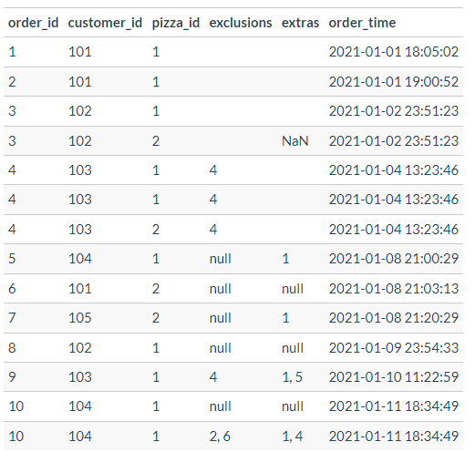

## TABLE 3 : RUNNER_ORDERS

The `runners_orders` table is composed of : 
- **order_id** - FOREIGN KEY
- **runner_id** - FOREIGN KEY
- **pickup_time** -  the timestamp at which the runner arrives at the Pizza Runner headquarters to pick up the freshly cooked pizza
- **distance** - distance to deliver the pizza
- **duration** - time to deliver the pizza
- **cancellation** - if there is a restaurant cancellation or a customer cancellation

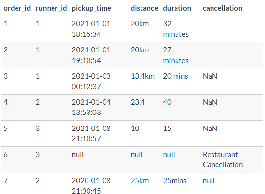

## TABLE 4 : PIZZA_NAMES

The `pizza_names` table is composed of : 
- **pizza_id** - PRIMARY KEY
- **pizza_name** - name of the pizza

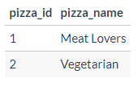

## TABLE 5 : PIZZA_RECIPES

The `pizza_recipes` table is composed of : 
- **pizza_id** - FOREIGN KEY
- **toppings** - ingrediens on the pizza

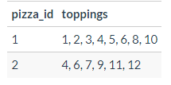

## TABLE 6 : PIZZA_TOPPINGS

The `pizza_toppings` table is composed of : 
- **topping_id** - PRIMARY KEY
- **topping_name** - ingredient name

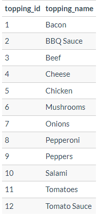

# CASE STUDY 

Before we are going further, we have to clean two datasets : `customer_orders` and `runner_orders`. 

**Creating Views with data cleaning**

1. In `customer_orders`, we have to set values to NULL when we don't any exclusion or extra ingrediens.
2. In `runner_orders`, we have to delete "km" from distance column and "minutes", "mins" or "minute" from duration column. We also need to set NULL value when there is not cancellation. 

All the 'null' values already in the datasets are in STRING type. We have to convert all in the correct NULL value. 

```sql
DROP SCHEMA IF EXISTS v_pizza_runner CASCADE; 
CREATE SCHEMA v_pizza_runner;

DROP VIEW IF EXISTS v_pizza_runner.runners; 
CREATE VIEW v_pizza_runner.runners AS
SELECT 
  *
FROM pizza_runner.runners; 

DROP VIEW IF EXISTS v_pizza_runner.customer_orders; 
CREATE VIEW v_pizza_runner.customer_orders AS
SELECT 
  order_id, 
  customer_id, 
  pizza_id, 
  CASE 
    WHEN exclusions = '' OR 
    exclusions = 'null' THEN NULL 
    ELSE exclusions
  END AS exclusions, 
  CASE 
    WHEN extras = ''  OR 
    extras = 'NaN' OR 
    extras = 'null' THEN NULL 
    ELSE extras
  END AS extras,
  order_time
FROM pizza_runner.customer_orders;

DROP VIEW IF EXISTS v_pizza_runner.runner_orders; 
CREATE VIEW v_pizza_runner.runner_orders AS
WITH cte_wrong_types AS (
  SELECT 
  order_id, 
  runner_id,
  CASE 
    WHEN pickup_time = 'null' THEN NULL
    ELSE pickup_time
  END AS pickup_time, 
  CASE 
    WHEN distance LIKE '%km%' THEN 
      (REGEXP_MATCH(
        distance, 
        '^\d*\.?\d*'
        )
      )[1]
    WHEN distance = 'null' THEN NULL 
    ELSE distance
  END AS distance, 
  CASE 
    WHEN duration ILIKE '%mins%' OR 
      duration ILIKE '%minutes%'OR
      duration ILIKE '%minute%' THEN 
      (REGEXP_MATCH(
        duration, 
        '^\d*\.?\d*'
        )
      )[1]
    WHEN duration = 'null' THEN NULL 
    ELSE duration
  END AS duration, 
  CASE 
    WHEN cancellation = '' OR 
    cancellation = 'NaN' OR 
    cancellation = 'null' THEN NULL
    ELSE cancellation
  END AS cancellation
FROM pizza_runner.runner_orders
)
SELECT 
  order_id, 
  runner_id, 
  pickup_time::TIMESTAMP WITHOUT TIME ZONE, 
  distance::NUMERIC, 
  duration::NUMERIC, 
  cancellation::TEXT
FROM cte_wrong_types;


DROP VIEW IF EXISTS v_pizza_runner.pizza_names; 
CREATE VIEW v_pizza_runner.pizza_names AS
SELECT 
  *
FROM pizza_runner.pizza_names;

DROP VIEW IF EXISTS v_pizza_runner.pizza_recipes; 
CREATE VIEW v_pizza_runner.pizza_recipes AS
SELECT 
  *
FROM pizza_runner.pizza_recipes; 

DROP VIEW IF EXISTS v_pizza_runner.pizza_toppings; 
CREATE VIEW v_pizza_runner.pizza_toppings AS
SELECT 
  *
FROM pizza_runner.pizza_toppings; 

DROP VIEW IF EXISTS v_pizza_runner.pizza_join; 
CREATE VIEW v_pizza_runner.pizza_join AS
SELECT 
  customer_orders.*, 
  runner_orders.cancellation, 
  pizza_names.pizza_name, 
  runner_orders.runner_id, 
  runner_orders.pickup_time,
  runner_orders.duration, 
  runner_orders.distance,
  DATE_PART('minute', AGE(pickup_time, order_time))::INTEGER AS pickup_minutes
FROM v_pizza_runner.customer_orders
LEFT JOIN v_pizza_runner.runner_orders   
  ON customer_orders.order_id = runner_orders.order_id
LEFT JOIN v_pizza_runner.pizza_names 
  ON customer_orders.pizza_id = pizza_names.pizza_id;
```

## Pizza Metrics 

First, we just consider pizzas. We want to have more informations about teh most ordered pizzas. 

## **Q1**

> How many pizzas were ordered?

```sql
SELECT 
  COUNT(*) AS total_purchases
FROM v_pizza_runner.customer_orders;
```
**COUNT : 14**

## **Q2**

> How many unique customer orders were made?

```sql
SELECT 
  COUNT(DISTINCT order_id) AS total_unique_orders
FROM v_pizza_runner.customer_orders; 
```

**COUNT : 10**

## **Q3**

> How many successful orders were delivered by each runner?

```sql 
SELECT 
  runner_id, 
  COUNT(order_id) AS number_deliveries
FROM v_pizza_runner.runner_orders
WHERE cancellation IS NULL
GROUP BY 1;
```

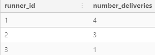

## **Q4**

> How many of each type of pizza was delivered?

```sql
SELECT 
  pizza_name,
  COUNT(*) AS number_pizzas
FROM v_pizza_runner.pizza_join
WHERE cancellation IS NULL
GROUP BY 1;
```


## **Q5**

> How many Vegetarian and Meatlovers were ordered by each customer?

```sql
SELECT
  customer_id,
  SUM(CASE WHEN pizza_id = 1 THEN 1 ELSE 0 END) AS meatlovers,
  SUM(CASE WHEN pizza_id = 2 THEN 1 ELSE 0 END) AS vegetarian
FROM v_pizza_runner.customer_orders
GROUP BY 1
ORDER BY 1;
```
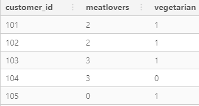

## **Q6**

> What was the maximum number of pizzas delivered in a single order?

```sql
SELECT 
  order_id,
  COUNT(pizza_id) AS number_pizzas
FROM v_pizza_runner.pizza_join
GROUP BY 1
ORDER BY 2 DESC 
LIMIT 1;
```


## **Q7**

> For each customer, how many delivered pizzas had at least 1 change and how many had no changes?

```sql
WITH cte_flag_change AS (
  SELECT 
    customer_id, 
    CASE 
      WHEN exclusions IS NOT NULL OR 
        extras IS NOT NULL THEN 1
      ELSE 0
    END AS flag_change
  FROM v_pizza_runner.pizza_join
  WHERE cancellation IS NULL
) 
SELECT 
  customer_id, 
  SUM(CASE WHEN flag_change = 1 THEN flag_change ELSE 0 END) AS at_least_1_change, 
  COUNT(CASE WHEN flag_change = 0 THEN flag_change END) AS no_changes 
FROM cte_flag_change
GROUP BY 1
ORDER BY 1;
```
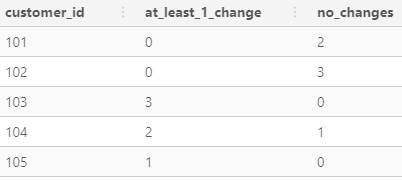

## **Q8**

> How many pizzas were delivered that had both exclusions and extras?

```sql
WITH cte_flag_change AS (
  SELECT 
    customer_id, 
    exclusions, 
    extras, 
    CASE 
      WHEN exclusions IS NOT NULL AND 
        extras IS NOT NULL THEN 1
      ELSE 0
    END AS flag_change
  FROM v_pizza_runner.pizza_join
  WHERE cancellation IS NULL
  ORDER BY order_id, customer_id
) 
SELECT 
  COUNT(*) AS number_pizzas
FROM cte_flag_change
WHERE flag_change = 1;
```

**COUNT : 1**

## **Q9**

> What was the total volume of pizzas ordered for each hour of the day?

```sql
SELECT 
  EXTRACT("HOUR" from order_time) AS hour, 
  COUNT(pizza_id) AS number_pizzas
FROM v_pizza_runner.pizza_join
GROUP BY 1
ORDER BY 1;
```

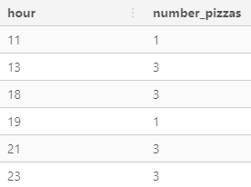

## **Q10**

> What was the volume of orders for each day of the week?

```sql
SELECT 
  TO_CHAR(order_time, 'Day') AS day_week, 
  COUNT(order_id) AS number_pizzas
FROM v_pizza_runner.pizza_join
GROUP BY 1
ORDER BY 1;
```
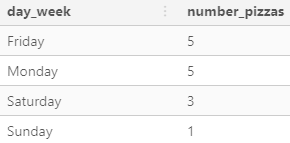

## Runner and Customer Experience

## **Q1**

> How many runners signed up for each 1 week period? (i.e. week starts 2021-01-01)

```sql
SELECT 
  DATE_TRUNC('week', registration_date)::DATE + 4 AS registration_week, 
  COUNT(*) AS runners_count
FROM v_pizza_runner.runners
GROUP BY 1
ORDER BY 1;
```
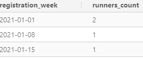

## **Q2**

> What was the average time in minutes it took for each runner to arrive at the Pizza Runner HQ to pickup the order?

*We have to modify the type of duration*

```sql
WITH cte_diff_time AS (
  SELECT DISTINCT
    order_id,
    pickup_time, 
    order_time, 
    DATE_PART('minute', AGE(pickup_time, order_time))::INTEGER AS pickup_minutes
  FROM v_pizza_runner.pizza_join
  WHERE cancellation IS NULL
) 
SELECT 
  ROUND(AVG(pickup_minutes), 3) AS avg_pickup_minutes
FROM cte_diff_time;
```


## **Q3**

> Is there any relationship between the number of pizzas and how long the order takes to prepare?

```sql
SELECT DISTINCT
  order_id,
  pickup_minutes, 
  COUNT(pizza_id) AS pizza_count
FROM v_pizza_runner.pizza_join
WHERE cancellation IS NULL
GROUP BY 1, 2
ORDER BY 3;
```

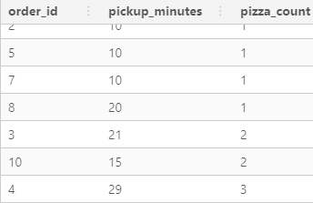

## **Q4**

> What was the average distance travelled for each customer?

```sql
SELECT 
  customer_id,
  ROUND(AVG(DISTINCT distance), 1) AS avg_distance
FROM v_pizza_runner.pizza_join
WHERE cancellation IS NULL
GROUP BY 1
ORDER BY 1;
```

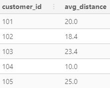

## **Q5**

> What was the difference between the longest and shortest delivery times for all orders?

```sql
SELECT 
  MAX(duration) - MIN(duration) AS max_diff_delivery_time
FROM v_pizza_runner.runner_orders
WHERE cancellation IS NULL;
```

**DIFF : 30**

## **Q6**

> What was the average speed for each runner for each delivery and do you notice any trend for these values?

```sql
WITH cte_trend_speed_time AS (
  SELECT 
    runner_id, 
    order_id,
    AVG(distance/duration) AS avg_km_per_minutes
  FROM v_pizza_runner.pizza_join 
  WHERE cancellation IS NULL
  GROUP BY 1, 2
  ORDER BY 1, 2
) 
SELECT  
  runner_id, 
  order_id,
  ROUND(avg_km_per_minutes * 60, 1) AS avg_km_per_hours, 
  ROUND(
    100 * (avg_km_per_minutes*60 - LAG(avg_km_per_minutes*60) OVER(PARTITION BY runner_id ORDER BY avg_km_per_minutes*60))/
    LAG(avg_km_per_minutes*60) OVER(PARTITION BY runner_id ORDER BY avg_km_per_minutes*60)::NUMERIC, 
    1
  ) AS trend_speed
FROM cte_trend_speed_time
ORDER BY 1, 2;
```

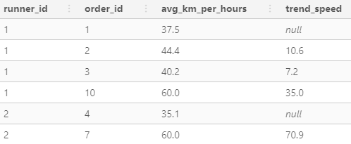

## **Q7**

> What is the successful delivery percentage for each runner?

```sql 
WITH cte_success_percentage AS (
  SELECT 
    runner_id,
    SUM(
      CASE 
        WHEN cancellation IS NULL THEN 1 
        ELSE 0
      END
    ) AS successful_delivery, 
    SUM(
      CASE 
        WHEN cancellation IS NOT NULL THEN 1 
        ELSE 0
      END
    ) AS cancelled_delivery
  FROM v_pizza_runner.runner_orders
  GROUP BY 1
)
SELECT 
  runner_id, 
  successful_delivery, 
  cancelled_delivery, 
  100 * successful_delivery / (successful_delivery + cancelled_delivery) AS success_percentage
FROM cte_success_percentage
ORDER BY 4 DESC;
```


# Ingredient Optimisation 

We focused our analysis into the pizzas, customers and runners. Now, we want to knoz more about the toppings. What toppings are the most purchases ? 

## **Q1**

> What are the standard ingredients for each pizza?

```sql
WITH cte_separate_string AS (
  SELECT  
    UNNEST(STRING_TO_ARRAY(toppings, ','))::NUMERIC AS topping_id,
    pizza_id
  FROM v_pizza_runner.pizza_recipes
), 
pizza_toppings_join AS (
  SELECT 
    cte_separate_string.*, 
    pizza_toppings.topping_name 
  FROM cte_separate_string 
  LEFT JOIN v_pizza_runner.pizza_toppings 
    ON cte_separate_string.topping_id = pizza_toppings.topping_id
)
SELECT 
  pizza_id, 
  STRING_AGG(topping_name, ', ') AS toppings
FROM pizza_toppings_join
GROUP BY 1
ORDER BY 1; 
```


## **Q2**

> What was the most commonly added extra?

```sql 
WITH cte_separate_string AS (
  SELECT  
    order_id,
    pizza_id, 
    --UNNEST(STRING_TO_ARRAY(exclusions, ','))::NUMERIC AS exclusion_id
    UNNEST(STRING_TO_ARRAY(extras, ','))::NUMERIC AS extra_id
  FROM v_pizza_runner.customer_orders
), 
pizza_toppings_join AS (
  SELECT 
    --cte_separate_string.exclusion_id, 
    cte_separate_string.extra_id, 
    pizza_toppings.topping_name 
  FROM cte_separate_string 
  LEFT JOIN v_pizza_runner.pizza_toppings 
    --ON cte_separate_string.exclusion_id = pizza_toppings.topping_id
    ON cte_separate_string.extra_id = pizza_toppings.topping_id
)
SELECT 
  topping_name, 
  COUNT(*) AS topping_count
FROM pizza_toppings_join
GROUP BY 1
ORDER BY 2 DESC; 
```


## **Q3**

> What was the most common exclusion?

We can take the same query as before and just uncomment few lines. 

```sql
WITH cte_separate_string AS (
  SELECT  
    order_id,
    pizza_id, 
    UNNEST(STRING_TO_ARRAY(exclusions, ','))::NUMERIC AS exclusion_id
    --UNNEST(STRING_TO_ARRAY(extras, ','))::NUMERIC AS extra_id
  FROM v_pizza_runner.customer_orders
), 
pizza_toppings_join AS (
  SELECT 
    cte_separate_string.exclusion_id, 
    --cte_separate_string.extra_id, 
    pizza_toppings.topping_name 
  FROM cte_separate_string 
  LEFT JOIN v_pizza_runner.pizza_toppings 
    ON cte_separate_string.exclusion_id = pizza_toppings.topping_id
    --ON cte_separate_string.extra_id = pizza_toppings.topping_id
)
SELECT 
  topping_name, 
  COUNT(*) AS topping_count
FROM pizza_toppings_join
GROUP BY 1
ORDER BY 2 DESC; 
```


## **Q4**

> Generate an order item for each record in the customers_orders table in the format of one of the following:
> * Meat Lovers
> * Meat Lovers - Exclude Beef
> * Meat Lovers - Extra Bacon
> * Meat Lovers - Exclude Cheese, Bacon - Extra Mushroom, Peppers

