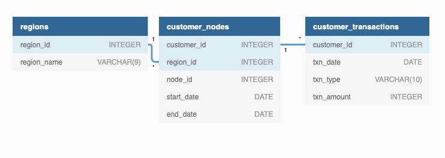
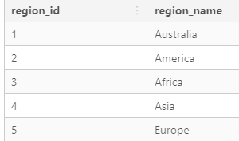
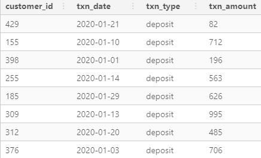
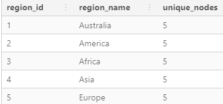
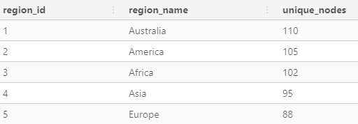

# Context

There is a new innovation in the financial industry called Neo-Banks: new aged digital only banks without physical branches.

Danny thought that there should be some sort of intersection between these new age banks, cryptocurrency and the data world…so he decides to launch a new initiative - Data Bank!

Data Bank runs just like any other digital bank - but it isn’t only for banking activities, they also have the world’s most secure distributed data storage platform!

Customers are allocated cloud data storage limits which are directly linked to how much money they have in their accounts. There are a few interesting caveats that go with this business model, and this is where the Data Bank team need your help!

The management team at Data Bank want to increase their total customer base - but also need some help tracking just how much data storage their customers will need.

This case study is all about calculating metrics, growth and helping the business analyse their data in a smart way to better forecast and plan for their future developments!


# DATASETS 

Three datasets : 
* regions
* customer_nodes
* customer_transactions

# ERD



## TABLE 1 : regions

The `regions` table is composed of : 
- **region_id** - PRIMARY KEY
- **region_name** - Continent name



## TABLE 2 : customer_nodes

The `customer_nodes` table is composed of : 
- **customer_id** - PRIMARY KEY
- **region_id** - FOREIGN KEY
- **node_id** - FOREIGN KEY 
- **start_date** 
- **end_date**


## TABLE 3 : customer_transactions

The `customer_transactions` table is composed of : 
- **customer_id** - FOREIGN KEY
- **txn_date** - Date of the transaction
- **txn_type** - Transaction type
- **txn_amount** - Amount of the transaction 




# CASE STUDY 

**LOAD INIT SQL FILE BEFORE TO INITIALIZE TABLES**

## Customer Nodes Exploration

## **Q1**

> How many unique nodes are there on the Data Bank system?

```sql
WITH combinations AS (
SELECT DISTINCT
  region_id,
  node_id
FROM data_bank.customer_nodes
)
SELECT COUNT(*) FROM combinations;
```
**25 nodes**
We can check further by region.

## **Q2**

> How many unique nodes are there on the Data Bank system?

```sql
SELECT 
  customer_nodes.region_id, 
  regions.region_name, 
  COUNT(DISTINCT node_id) AS unique_nodes
FROM data_bank.customer_nodes
INNER JOIN data_bank.regions
ON customer_nodes.region_id = regions.region_id
GROUP BY 1, 2; 
```


5 nodes by region

## **Q3**

> How many customers are allocated to each region?

```sql
SELECT 
  customer_nodes.region_id, 
  regions.region_name, 
  COUNT(DISTINCT customer_id) AS unique_nodes
FROM data_bank.customer_nodes
INNER JOIN data_bank.regions
ON customer_nodes.region_id = regions.region_id
GROUP BY 1, 2; 
```


## **Q4**

> How many days on average are customers reallocated to a different node?

